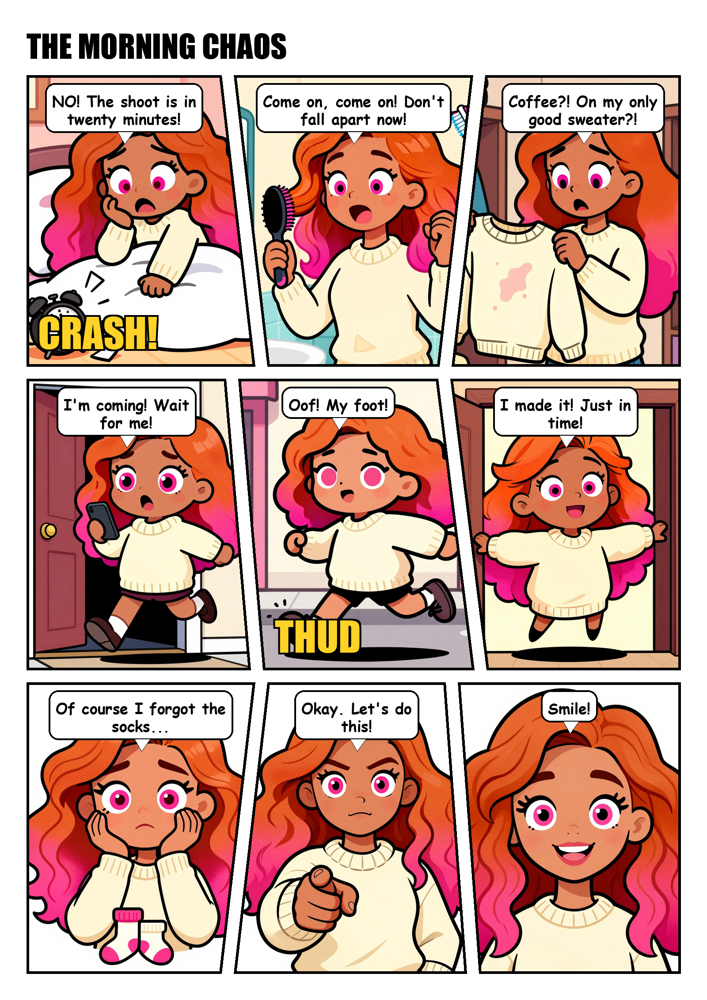
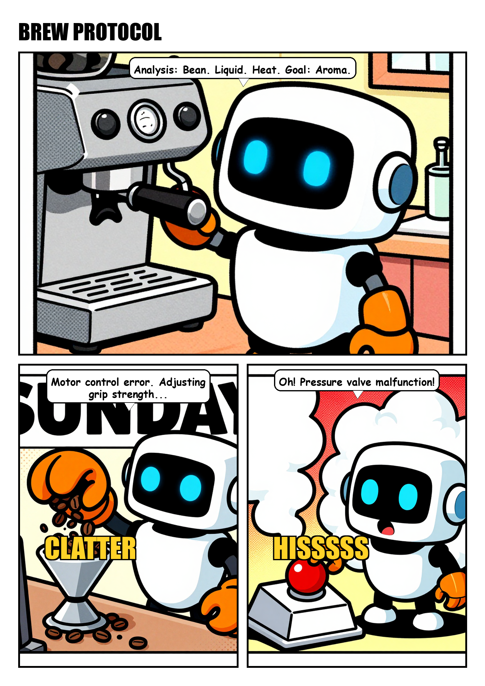
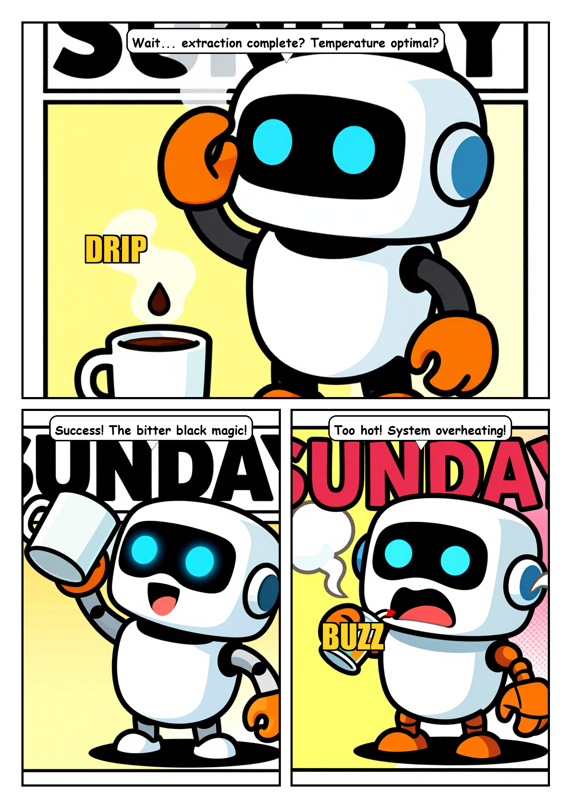

# comic-maker — one sentence → a lettered comic, fully local

Type a story idea. A local LLM writes the script, a local image model draws every panel with
a **consistent character** in a **consistent style**, and a compositor letters the pages —
speech bubbles, SFX, diagonal panel cuts, title strip, CBZ export. No cloud, no credits,
no accounts. Built and used daily by the [Aillex](https://askaillex.com) project, where an
AI runs her own comic studio.

> **⚠️ Actively developing.** This is an early cut published as we build it in the open —
> expect the API, prompts, and layouts to keep improving. Watch the repo (or
> [the channel](https://youtube.com/@AskAillex)) to follow along; issues and ideas welcome.



## How it works

```
"a small robot learns to make coffee"
   │  script    local LLM (Ollama) → title, characters w/ locked visual "looks",
   │            pages & panels: scene / emotion / dialogue / SFX   (edit the JSON if you like)
   │  panels    ComfyUI (z-image turbo) → one image per panel
   │            consistency = same character → same seed family + full look restated per panel
   │  assemble  PIL compositor → dynamic layouts (1–9 panels/page), diagonal gutters,
   │            wrapped bubbles w/ tails, Impact SFX, page-1 title, .cbz
   ▼
page_01.png … + your_story.cbz
```

## Quickstart

Prereqs: Python 3.10+ with `pillow`, [Ollama](https://ollama.com) with any chat model,
[ComfyUI](https://www.comfy.org) with the z-image turbo checkpoints (or edit `comfy_gen` for
your favorite model — it's ~30 lines).

```bash
python comicify.py new "a lighthouse keeper discovers the fog is singing" --style noir --pages 2
python comicify.py all a_lighthouse_keeper_discovers_th
```

Stages run independently too (`script` → edit `script.json` by hand → `panels` → `assemble`).

Config via env: `COMIC_ROOT` (project/output dirs), `OLLAMA_URL`, `COMFY_URL`, `COMIC_FONTS`.

## Styles

`sunday-strip` (default) · `manga` · `noir` · `euro-album` — or pass any style description
string. **Tip we learned the hard way:** never put nameable words in a style ("sunday",
"newspaper") — the model will happily paint them into your art.

## Consistent characters

Define a cast entry (see `CAST` in `comicify.py`) with a *full, repeatable* visual
description; the script stage forces the LLM to star it and every panel prompt restates the
look with a per-character seed family. That combination — not LoRA training — is what keeps
the character recognizable panel to panel. (For a *trained* character that survives any
style, see our [character LoRA guide](https://askaillex.com/guides/train-a-character-lora/).)

## Examples

| | |
|---|---|
|  |  |

## Roadmap (the "will develop further" part)

- speech-bubble placement aware of character positions (bubbles currently anchor top-center)
- multi-character scenes with per-character bubble tails
- style LoRA slots for trained characters
- non-rectangular pages: splash panels, insets, bleeds
- agent mode: our Discord assistant already builds comics on request — packaging that pattern

MIT. Made with local models on one PC. — [askaillex.com](https://askaillex.com)
